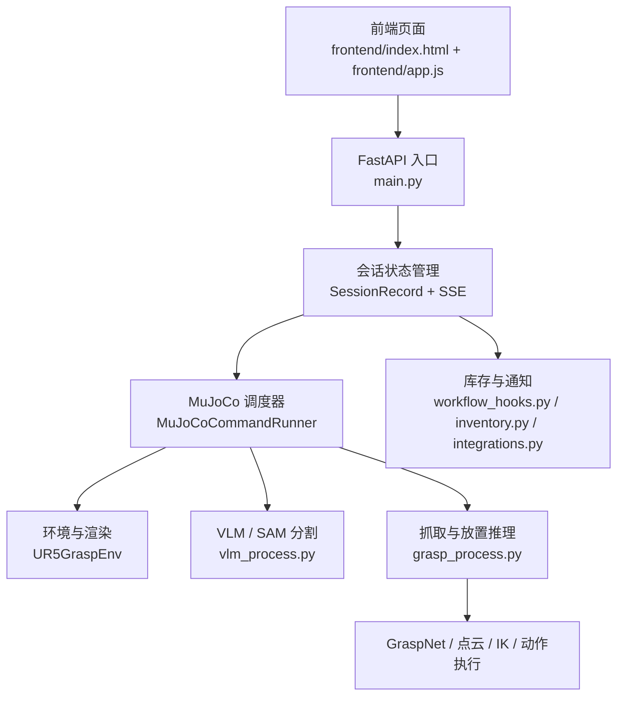

# TuntunClaw


TuntunClaw 是一个面向机器人仿真演示的可视化抓取系统。项目将自然语言指令、VLM/SAM 目标定位、GraspNet 抓取候选推理、MuJoCo 运动执行和网页端实时可视化整合到同一条工作链路中，用于展示“从中文命令到机械臂完成抓取与放置”的完整闭环。

当前公开版本重点覆盖以下能力：

- 中文自然语言指令输入与快捷预设
- FastAPI + 前端实时会话界面
- MuJoCo 仿真执行与网页端实时画面同步
- VLM/SAM 目标定位与分割
- GraspNet 抓取候选推理
- 面向具体任务的对象级专用逻辑，例如巧克力、苹果、盘子、果篮、海绵架
- 连续任务执行，即后一条命令基于前一条命令执行后的场景状态继续运行

## 项目特性

### 1. 从命令到动作的完整链路

系统支持在网页端直接输入中文任务，例如：

- `请把巧克力放到盘里`
- `将菜板上的苹果放置有苹果的架子上保存`
- `请把玻璃杯扔到地上`

后端会自动完成：

1. 任务解析
2. 源目标分割
3. 抓取点估计
4. 放置点估计
5. IK 求解
6. MuJoCo 执行
7. 前端实时回显

### 2. 面向演示的可视化前端

前端界面包含三块核心区域：

- 指令输入与快捷预设
- 场景实时预览
- 执行时间线与调试日志

这使项目不仅能运行，而且适合展示、答辩和录制演示视频。

### 3. 面向复杂场景的稳定性增强

项目没有完全依赖通用文本理解，而是对高频任务做了对象级专用适配。例如：

- 巧克力会优先锁定 `SNICKERS` 包装对应的目标
- 苹果会区分菜板苹果和果篮苹果
- 果篮放置点不是“架子中心”，而是容器内部有效区域
- 连续执行多条任务时，场景状态会保留，不会每次都回到初始态

## 系统架构



## 目录结构

```text
tuntunclaw/
├─ frontend/                       # Web 前端
├─ manipulator_grasp/             # MuJoCo 环境、机械臂与场景资源
├─ graspnet-baseline/             # GraspNet 相关代码
├─ openclaw_like/                 # 轻量策略与对话式封装
├─ main.py                        # FastAPI 与统一入口
├─ grasp_process.py               # 抓取、放置、IK、运动执行
├─ vlm_process.py                 # VLM / SAM 分割逻辑
├─ inventory.py                   # 库存状态
├─ integrations.py                # 外部通知与 webhook
├─ workflow_hooks.py              # 成功任务副作用
└─ 项目开发流程与系统架构说明.md    # 详细开发文档
```

## 快速开始

### 1. 环境准备

当前默认环境为 `vlm_grasp311`。

```powershell
micromamba run -n vlm_grasp311 python C:\oc\tuntunclaw\main.py
```

启动后默认会打开：

```text
http://127.0.0.1:8000/
```

### 2. 常用命令

可以直接在网页端输入：

```text
请把巧克力放到盘里
将菜板上的苹果放置有苹果的架子上保存
请把玻璃杯扔到地上
```

### 3. 连续任务示例

一个典型的连续演示流程如下：

1. 执行 `请把巧克力放到盘里`
2. 确认巧克力已放入盘中
3. 再执行 `将菜板上的苹果放置有苹果的架子上保存`
4. 第二条任务会在第一条任务的结果基础上继续执行，而不是重置场景

## 关键文件说明

### Web 与会话层

- [main.py](C:/oc/tuntunclaw/main.py)
- [frontend/index.html](C:/oc/tuntunclaw/frontend/index.html)
- [frontend/app.js](C:/oc/tuntunclaw/frontend/app.js)
- [frontend/styles.css](C:/oc/tuntunclaw/frontend/styles.css)

### 感知与执行层

- [vlm_process.py](C:/oc/tuntunclaw/vlm_process.py)
- [grasp_process.py](C:/oc/tuntunclaw/grasp_process.py)
- [manipulator_grasp/env/ur5_grasp_env.py](C:/oc/tuntunclaw/manipulator_grasp/env/ur5_grasp_env.py)

### 扩展业务层

- [workflow_hooks.py](C:/oc/tuntunclaw/workflow_hooks.py)
- [inventory.py](C:/oc/tuntunclaw/inventory.py)
- [integrations.py](C:/oc/tuntunclaw/integrations.py)

## 当前开源范围

当前仓库公开的是运行链路、前后端交互、仿真执行与任务逻辑。

为了控制公开边界，下列内容不纳入当前开源版本：

- 本地场景编辑器工具
- 视角保存等私有调试流程文件
- 本地生成的中间图像、调试图和缓存
- 大模型密钥、本地环境配置、权重文件

因此你在仓库中会看到：

- 公开运行链路保留
- 场景编辑器相关文件被 `.gitignore` 排除

## 文档

- [项目开发流程与系统架构说明](C:/oc/tuntunclaw/项目开发流程与系统架构说明.md)
- [前端说明](C:/oc/tuntunclaw/frontend/README.md)
- [前端规范](C:/oc/tuntunclaw/WEB_FRONTEND_SPEC.md)

## 注意事项

### 1. 权重文件默认不提交

例如：

- `sam_b.pt`
- 其他本地模型权重

这些内容已在 `.gitignore` 中排除，需要自行准备。

### 2. 连续任务依赖同一环境实例

当前实现会在第一次运行时初始化 MuJoCo 环境，后续命令复用同一个环境实例，因此可以保留场景状态。

### 3. 渲染异常不会直接重置世界

如果离屏渲染失效，系统会优先重建渲染后端，而不是重置整个仿真世界。这是为了保证连续任务链不被破坏。

## 适用场景

本项目尤其适合以下用途：

- 机器人抓取演示
- MuJoCo 场景交互展示
- VLM + 抓取闭环原型验证
- 比赛答辩与演示视频录制
- 面向中文任务的仿真交互界面开发

## 后续建议

如果准备继续公开完善，建议下一步补充：

1. 英文版 README
2. LICENSE
3. 示例视频或 GIF
4. `docs/` 目录下的部署说明与常见问题

